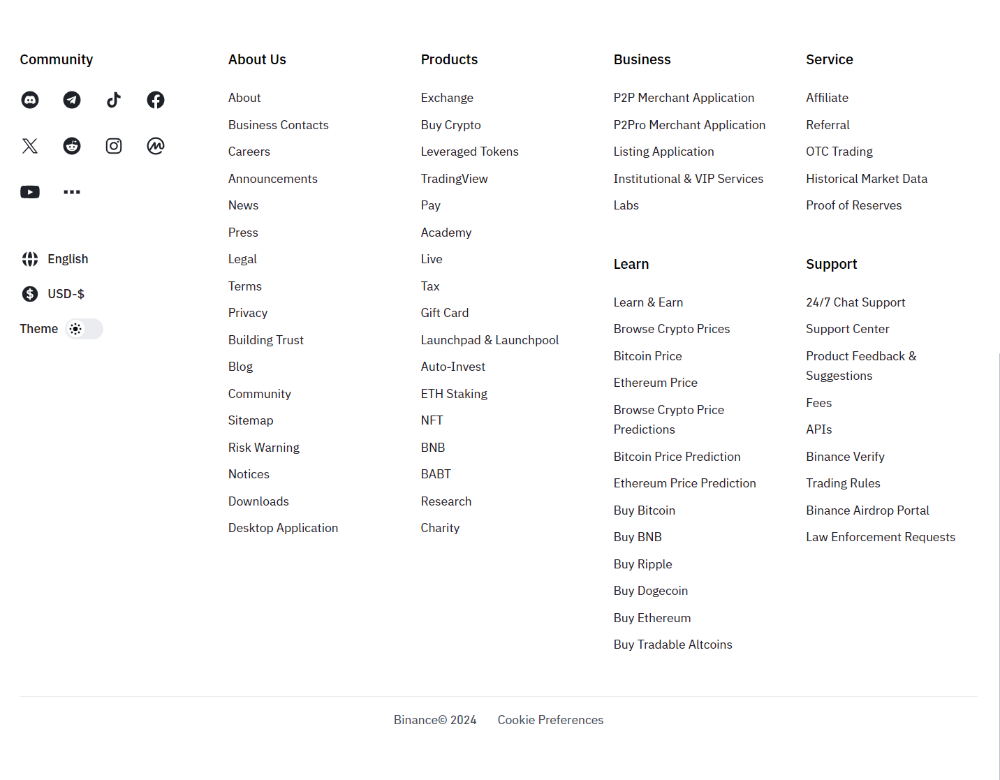

# Footer - micro-component

ideas from https://www.binance.com/en

# Introduce

We will create a simple footer with html, css, js from the example in internet

# Version history:

- Version 0.1: Simple layout (mobile view)
  
  _(image) Version 0.1_

- Version 0.2: Fully responsive
  
  _(image) Version 0.2_

- Version 0.3: Modal and action (for settings tab - change language and currency -> only combo box this will not change the current view or may be in the future later)

_(image) Version 0.3 Mobile view_

_(image) Version 0.3 Laptop view_

- Version 0.4: Theme color change and auto with system color scheme (change theme button)
