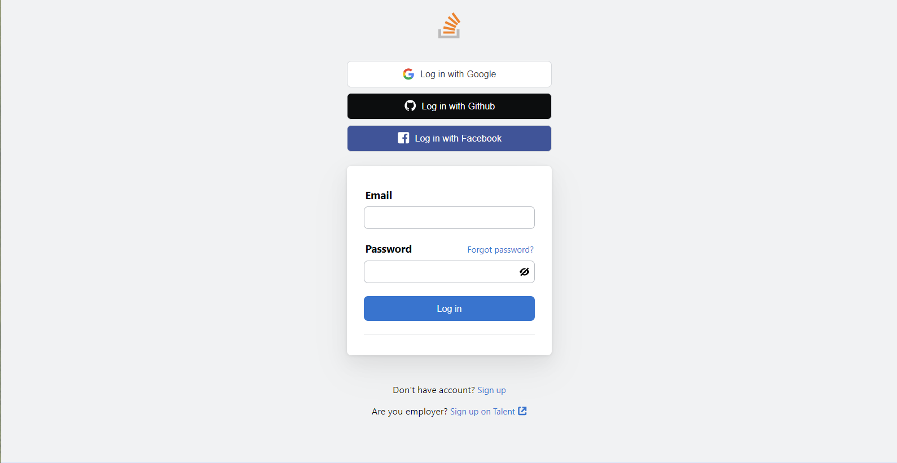

# Login form - micro-component

ideas from https://stackoverflow.com/users/login

# Introduce

We will create a simple Login form with html, css, js from the example in internet

# Version history:

- Version 0.1: Done login form
  
  _(image) Version 0.1_
