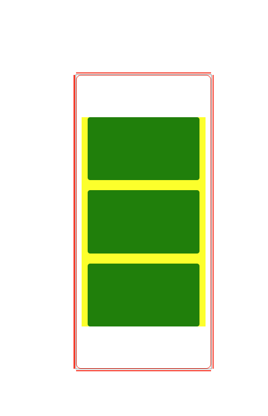

# Grid resizable container - micro-component

ideas from [site]

# Introduce

We will create a simple Resizable grid with html, css, js from the example in internet

1. The current resizable box (the box can resize from both horizontal and vertical is pending -> time to do more than using library) [X]

2. The grid item inner the box can recalculate and give the max possible items can inner the box with spacing [X]

We will focus on how render many as possible box with video aspect ratio ( For video conference box :D)

With draggable and resizable box I have found this link https://www.youtube.com/watch?v=NpBZtR1nLwA

# Version history:

- Version 0.1: View when have multiple
  
  _(image) Version 0.1_

- Version 0.1: View when have 1 row, or column
  
  _(image) Version 0.2_

- Version 0.2: View when you can resizable from edge
  
  _(image) Version 0.2_
