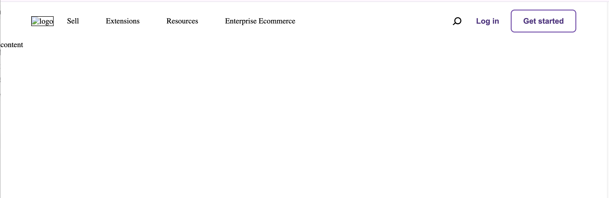
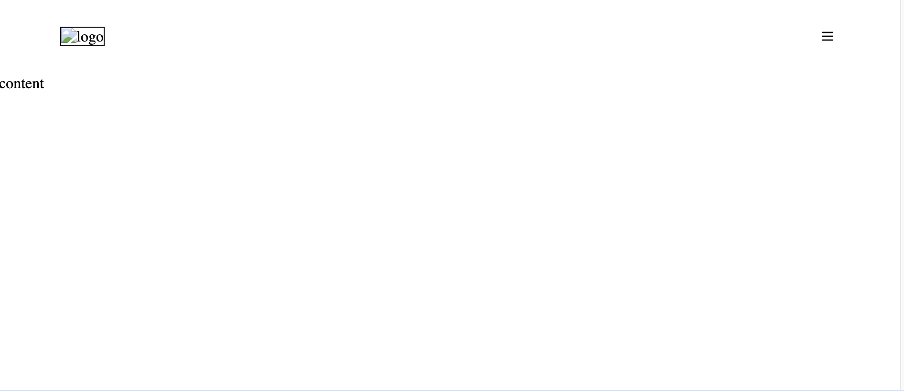
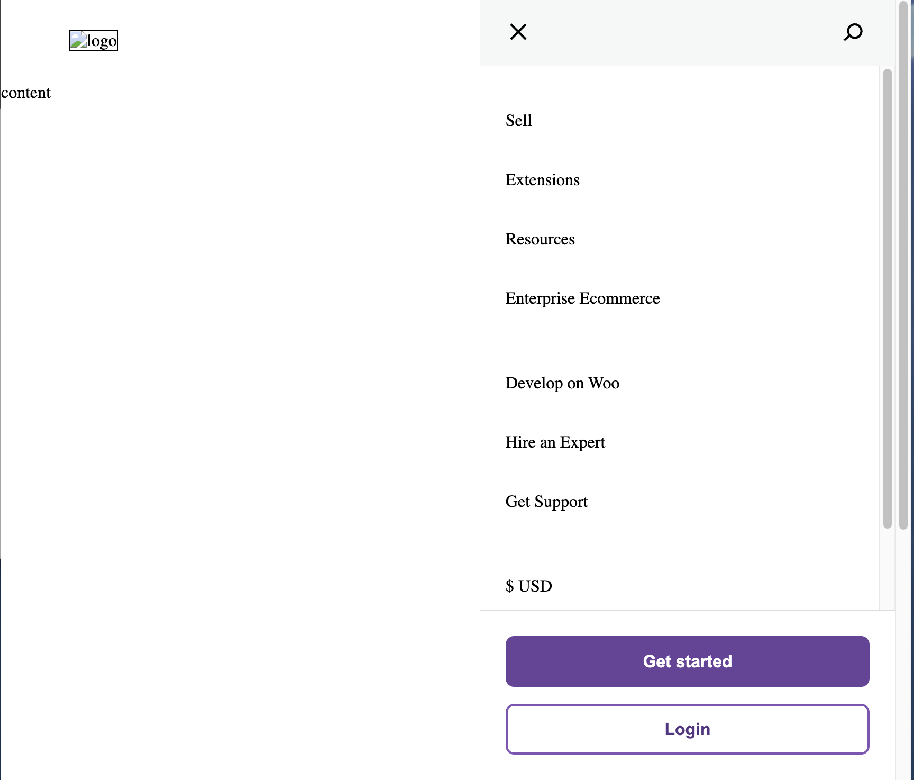
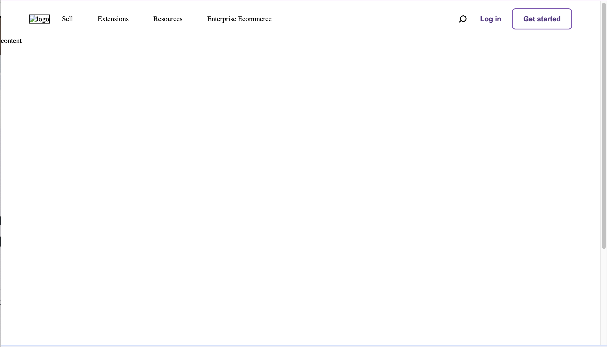
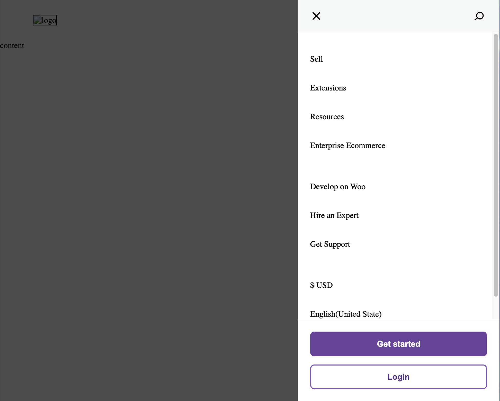

# Navigation bar - micro-component

ideas from https://woo.com/

# Introduce

We will create a simple navigation bar with html, css, js from the example in internet

# Version history:

- Version 0.1: Horizontal simple navigation with only link
  
  _(image) Version 0.1_
- Version 0.2: Horizontal responsive simple
  
  _(image) Version 0.2_
- Version 0.3: Vertical simple navigation
  
  _(image) Version 0.3_
- Version 0.4: Add action and overlay for vertical navigation
  
  _(image) Version 0.4 horizontal_
  
  _(image) Version 0.4 vertical_
