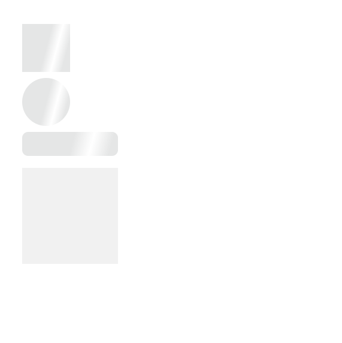

# Skeleton box - micro-component

ideas from
https://daisyui.com/components/skeleton/
https://mui.com/material-ui/react-skeleton/

- variant:

1. rect
2. circular
3. rounded

- base on classnames attribute

# Introduce

We will create a simple Skeleton with html, css, js from the example in internet

# Version history:

- Version 0.1: Skeleton done
  
  _(image) Version 0.1_
