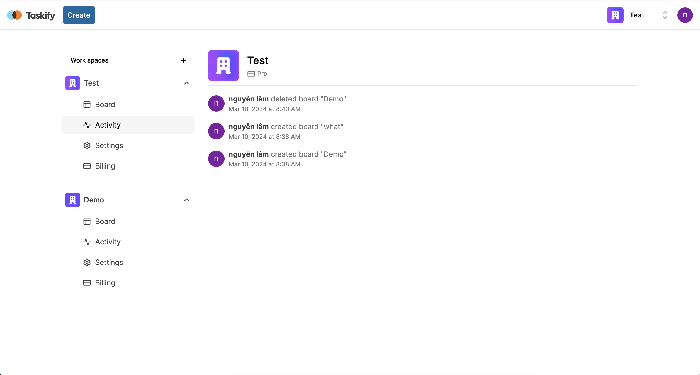
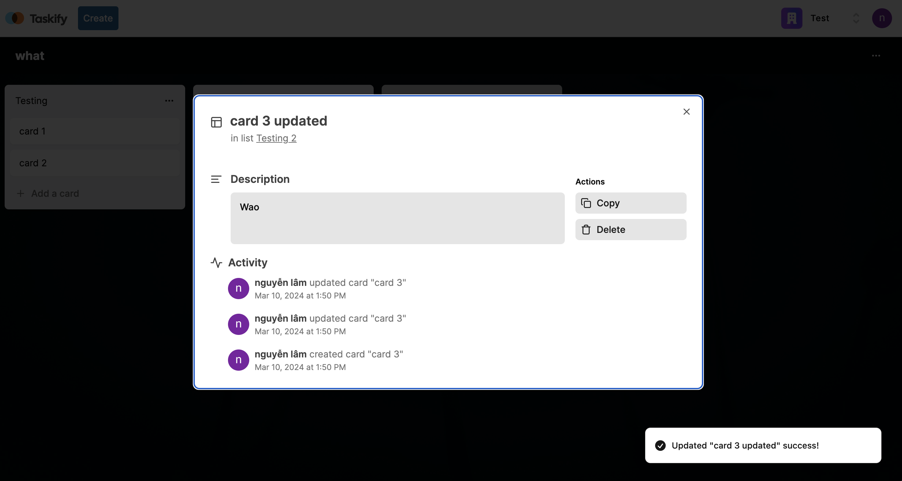
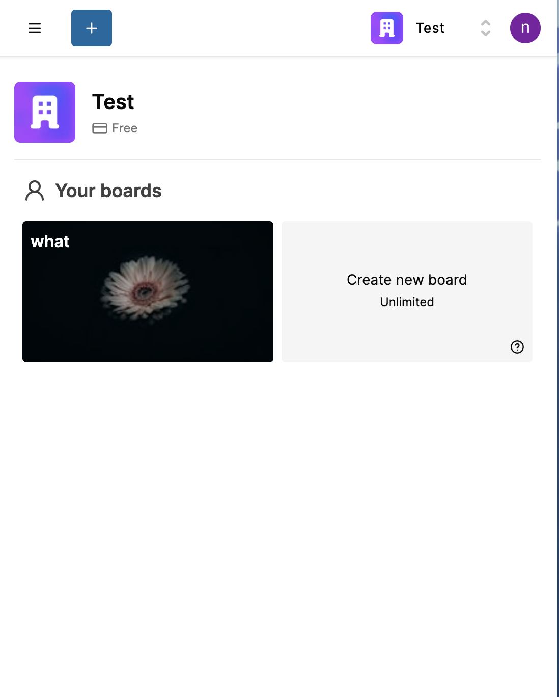

# Trello clone

idea from : https://github.com/AntonioErdeljac/next13-trello

# First thing first

When learning nextjs I confused so much. So, I choose both self learning and learning from other people have mini project to improve my self skill

This is project with idea from antonio who have a youtube chanel about development some clone app

# Tech stacks

- Nextjs(14) + React(18)
- NextAuth
- Prima + MongoDB
- Next actions
- Shadcn + tailwindcss
- stripe

# Key features

- Landing page
- Organizations / Workspaces
- Board creation, rename, delete
- unsplash api -> image
- activity log for entire organization
- List creation, rename, delete, drag & drop, reorder and copy
- Card creation, description, rename, delete, drag & drop, reorder, copy and activity log
- Board limitation
- Stripe subscription for every organization to unlock limited of boards

# Notes

This project will using **ACTIONS** from Nextjs to handle almost all action from client side.

# instructions

```
npm i

#setting all environment variable .env

npx prisma generate
npx prisma db push

npm run dev

```

# demos




